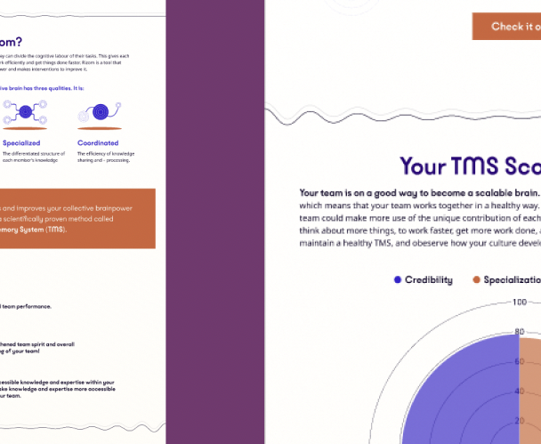

Here are some examples of Yeehaa’s principles in action

## Case 1

### [Intermin](../Cases/Intermin.md)

Technology as a vessel of transformation that enables the organization to reframe work and processes.

[Connect](../About.md)

## Case 3

### [Superconnectors](../Cases/Superconnectors.md)

Creating an ecosystem of high trust by sharing vulnerabilities rather than accomplishments

[Connect](../About.md)

## Case 3

### [Rizom](../Cases/Rizom.md)

Using engagement Loops to enhance the collective brain power

[Connect](../About.md)
