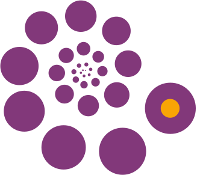
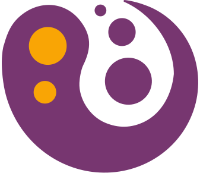
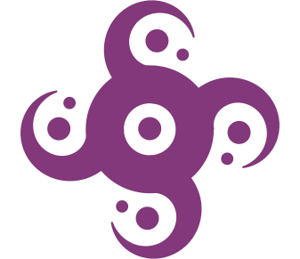
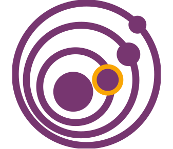

Yeehaa is an [ecosystem architect](../Ideas/Ecosystem%20Architecture.md). Designing virtual spaces for high-trust networks through a variety of approaches 

including

## [Value Driven Development](../Posts/Value%20Driven%20Development.md)

Introduction of tools and techniques to make the ethics of a practice measurable, reproducible, and communicable.

## [Vessel of Transformation](../Ideas/Vessel%20of%20Transformation.md)

Unexpected, small, local and timely interventions that reinvigorate teams, organisations, and communities.

## [Engagement Loops](../Ideas/Engagement%20Loops.md)

Tailormade hooks that both stimulate users to actively participate as well as generate feedback data for future improvements.

## [Organic Governance](../Ideas/Organic%20Governance.md)

Dynamic set of rules of conduct that are designed to prevent cacophony while maximizing diversity and inclusivity within teams and networks.
